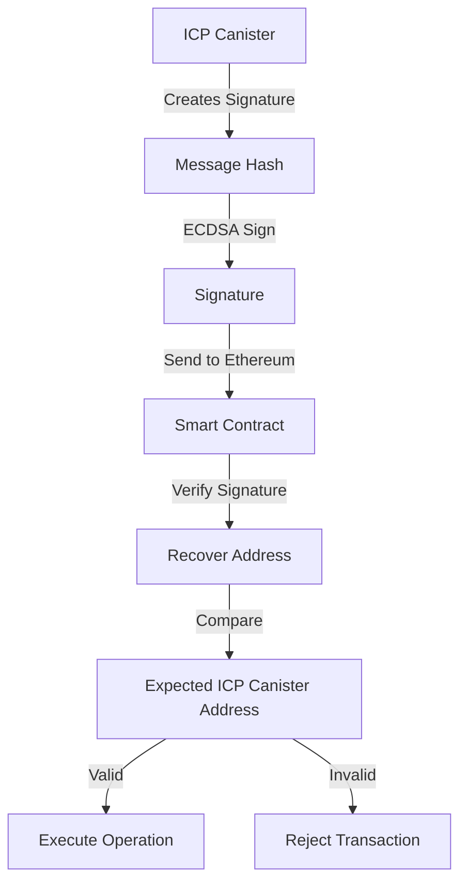

# ICP Signature Verification Example

This directory contains an example implementation of ICP (Internet Computer Protocol) signature verification in Ethereum smart contracts, based on the original EVM Locker contract.

## Overview

The ICP Signature Verification Example demonstrates how to integrate ICP canister signatures with Ethereum smart contracts for secure fund management operations. This implementation maintains the same functionality as the original Locker contract but uses ICP signatures instead of EVM signatures.

## Key Features

- **ICP Signature Verification**: Verify signatures created by ICP canisters using ECDSA with secp256k1 curve
- **Fund Management**: Deposit and withdraw both native ETH and ERC20 tokens
- **Replay Protection**: Prevent signature reuse with nonce-based validation
- **Multi-token Support**: Handle multiple token types for different canisters
- **Upgradeable**: Built with OpenZeppelin's upgradeable contracts pattern
- **Comprehensive Testing**: Full test suite covering all functionality

## Architecture

### Core Components

1. **ICPSignatureVerifierExample.sol**: Main contract implementing fund management with ICP signature verification
2. **ICPSignatureVerifier.sol**: Utility library for ICP signature verification
3. **ICPSignatureVerifier.t.sol**: Comprehensive test suite
4. **DeployICPSignatureVerifier.s.sol**: Deployment script with configuration options

### Signature Verification Flow



## Contract Functions

### Initialization
- `initialize(address _icpCanister, string _chainId)`: Initialize contract with ICP canister address

### Fund Management
- `depositTokens(string _canisterId)`: Deposit native ETH for a canister
- `depositFunds(string _canisterId, uint256 _amount, address _token)`: Deposit ERC20 tokens
- `withdraw(...)`: Withdraw funds with ICP signature verification
- `withdrawTokens(...)`: Withdraw native ETH with ICP signature verification

### Signature Verification
- `verifyCustomMessage(string message, bytes signature)`: Verify arbitrary message signatures
- `validateICPSignature(bytes32 dataHash, bytes signature)`: Internal signature validation

### Administration
- `setICPCanisterAddress(address _icpCanister)`: Update ICP canister address
- `getBalance(string _canisterId, address _token)`: Query canister token balance

## Usage Examples

### 1. Deploying the Contract

```bash
# Set environment variables
export ICP_CANISTER_ADDRESS="0x1234567890123456789012345678901234567890"
export CHAIN_ID="ethereum"

# Deploy using Foundry
forge script script/DeployICPSignatureVerifier.s.sol --rpc-url $RPC_URL --broadcast
```

### 2. Depositing Funds

```solidity
// Deposit native ETH
icpVerifier.depositTokens{value: 1000 ether}("rdmx6-jaaaa-aaaah-qcaiq-cai");

// Deposit ERC20 tokens
token.approve(address(icpVerifier), 1000 ether);
icpVerifier.depositFunds("rdmx6-jaaaa-aaaah-qcaiq-cai", 1000 ether, address(token));
```

### 3. Withdrawing with ICP Signature

```solidity
// Create message hash (this would be done by the ICP canister)
bytes32 messageHash = keccak256(abi.encodePacked(
    nonce, amount, msg.sender, chainId, canisterId, tokenAddress
));

// ICP canister signs the message hash and sends signature
bytes memory signature = icpSignature; // From ICP canister

// Withdraw funds
icpVerifier.withdraw(canisterId, tokenAddress, nonce, amount, signature);
```

### 4. Verifying Custom Messages

```solidity
// Verify arbitrary message signatures
bool isValid = icpVerifier.verifyCustomMessage("Hello World", signature);
```

## ICP Integration

### Setting Up ICP Canister

1. **Generate ECDSA Key**: Your ICP canister needs an ECDSA key for signing
2. **Derive Ethereum Address**: Convert the public key to an Ethereum address
3. **Configure Signing**: Implement signature creation in your ICP canister
4. **Deploy Contract**: Use the derived address as the ICP canister address

### Signature Format

ICP signatures follow the same format as Ethereum signatures:
- **Length**: 65 bytes
- **Components**: r (32 bytes) + s (32 bytes) + v (1 byte)
- **Recovery ID**: v must be 27 or 28

### Message Hashing

The contract uses Ethereum's message prefix for signature verification:
```
"\x19Ethereum Signed Message:\n32" + messageHash
```

## Security Considerations

### Signature Validation
- All signatures are validated against the configured ICP canister address
- Invalid signatures are rejected before any state changes
- Signature format is validated before processing

### Replay Protection
- Each signature can only be used once
- Nonces prevent replay attacks across different operations
- Signature reuse is tracked and prevented

### Access Control
- Only the contract owner can update the ICP canister address
- Users can only withdraw their own deposited funds
- Canister ID format is validated (27 characters)

## Testing

Run the comprehensive test suite:

```bash
# Run all tests
forge test --match-contract ICPSignatureVerifierTest

# Run specific test
forge test --match-test testWithdrawWithValidSignature

# Run with gas reporting
forge test --match-contract ICPSignatureVerifierTest --gas-report
```

### Test Coverage

- ✅ Contract initialization and configuration
- ✅ ICP signature verification (valid and invalid)
- ✅ Fund deposit and withdrawal operations
- ✅ Signature replay protection
- ✅ Error handling and edge cases
- ✅ Multi-token support
- ✅ Access control and permissions

## Deployment

### Prerequisites

1. **Foundry**: Install [Foundry](https://book.getfoundry.sh/getting-started/installation)
2. **Environment Setup**: Configure RPC URLs and private keys
3. **ICP Canister**: Deploy and configure your ICP canister

### Deployment Steps

1. **Configure Environment**:
   ```bash
   export ICP_CANISTER_ADDRESS="0x..."
   export CHAIN_ID="ethereum"
   export RPC_URL="https://..."
   export PRIVATE_KEY="0x..."
   ```

2. **Deploy Contract**:
   ```bash
   forge script script/DeployICPSignatureVerifier.s.sol --rpc-url $RPC_URL --broadcast
   ```

3. **Verify Contract** (optional):
   ```bash
   forge verify-contract <CONTRACT_ADDRESS> src/examples/ICPSignatureVerifier.sol --chain-id <CHAIN_ID>
   ```

## Differences from Original Locker

| Feature | Original Locker | ICP Signature Verifier |
|---------|----------------|----------------------|
| Signature Type | EVM signatures | ICP signatures |
| Signer | Ethereum address | ICP canister address |
| Verification | `ecrecover` | Custom ICP verification |
| Message Format | Standard EVM | Ethereum-compatible |
| Integration | Direct EVM | Cross-chain (ICP ↔ EVM) |

## Troubleshooting

### Common Issues

1. **Invalid Signature**: Ensure the ICP canister is using the correct private key
2. **Wrong Canister Address**: Verify the Ethereum address derivation from ICP public key
3. **Signature Replay**: Check that nonces are unique and signatures aren't reused
4. **Insufficient Balance**: Ensure sufficient funds are deposited before withdrawal

### Debug Tips

- Use `verifyCustomMessage()` to test signature verification independently
- Check event logs for signature verification results
- Verify canister ID format (must be 27 characters)
- Ensure proper message hash construction

## Contributing

When contributing to this example:

1. Follow the existing code style and patterns
2. Add comprehensive tests for new functionality
3. Update documentation for any changes
4. Ensure backward compatibility with existing deployments

## License

This example is provided under the same license as the main project. See the project root for license details.

